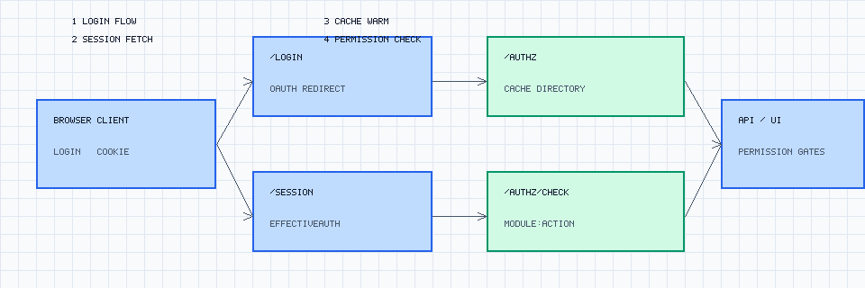

# google-authz

Authorization, session, and workspace-inventory service for Google Workspace tenants. `google-authz` centralizes the login flow, caches effective authorization documents, and exposes HTTP endpoints (`/login`, `/session`, `/authz`, `/authz/check`) so your apps can enforce scopes consistently.

## Features
- **Google Workspace aware** – fetches directory groups, schemas, and custom attributes to build an `EffectiveAuth` document per user.
- **Session + token exchange** – OAuth-based login plus signed session cookies for zero-trust APIs.
- **Declarative enforcement** – `/authz/check` evaluates module/action pairs and returns permitted verbs for UI gating.
- **Framework helpers** – FastAPI/Flask/Django helpers ship in [`google-authz-client`](https://github.com/example/google-authz-client) for easy integration.
- **Redis caching** – pluggable cache keeps `/authz` hot while respecting TTL + warm thresholds.

## Quick Start (Docker Compose)
1. Copy the sample environment file and edit secrets:
   ```bash
   cp .env.example .env
   $EDITOR .env
   ```
2. Supply your Google OAuth credentials, delegated admin, and Redis/session secrets in `.env`.
3. Launch the stack (google-authz + redis):
   ```bash
   docker compose -f docker-compose.local.yml up --build
   ```
4. Visit `http://localhost:8000/docs` for FastAPI docs or `http://localhost:8000/login` to exercise the OAuth flow.

The compose file mounts `private/` for service-account JSON. Use `docker compose down -v` to tear everything down when done.

## Configuration Overview
Core settings live in `.env` and are documented in detail in [`docs/config.md`](docs/config.md). Highlights:

| Variable | Description |
| --- | --- |
| `GOOGLE_WORKSPACE_DELEGATED_USER` | Admin user delegated to query the Workspace Directory API. |
| `GOOGLE_OAUTH_CLIENT_ID` / `GOOGLE_OAUTH_CLIENT_SECRET` | OAuth credentials created in Google Cloud Console. |
| `GOOGLE_OAUTH_REDIRECT_URI` | Must match the authorized redirect for the OAuth client (e.g., `http://localhost:8000/oauth/callback`). |
| `SESSION_SIGNING_SECRET` | HMAC secret used to sign session cookies. |
| `REDIS_URL` | Optional external Redis instance; defaults to the compose service. |
| `ALLOWED_ORIGINS` | Comma-separated list for browser clients that call `/session`. |

👉 Check [`docs/security.md`](docs/security.md) for secret management guidance and rotation playbooks.

## Architecture
The login and authorization exchange follow a simple set of hops:



The editable SVG lives at [`docs/img/architecture-v0.6.svg`](docs/img/architecture-v0.6.svg) if you need to tweak arrows or colors.

## Deployment Guides
- [`docs/deployment.md`](docs/deployment.md) – Docker Compose walkthrough, Kubernetes notes, and secrets management tips.
- [`docs/kubernetes/`](docs/kubernetes/README.md) – Manifest suite example for namespaces, secrets, and ingress.
- [`examples/`](examples) – React client, FastAPI backend, and Vite starter templates wired to `/login`, `/session`, and `/authz/check`.

## FAQ
**How do I define custom schemas?**
: Use the Admin Console to add custom schemas, then surface them through `GOOGLE_WORKSPACE_AUTH_SCHEMA`. The `/authz` response automatically hydrates schema fields so policies can reference them.

**How do I add new scopes / modules?**
: Update the JSON schema that drives your RBAC modules, redeploy, and use `/authz/check` to evaluate new `module:action` combinations. Sample DSLs live in [`docs/roadmap.md`](docs/roadmap.md).

**Can I bring my own cache or database?**
: Yes. Provide `REDIS_URL` for Redis Enterprise or switch `redis_location` to `in-memory` for tests. Additional cache backends can be added via `app.lib.cache`.

**Where can I report bugs or get help?**
: Open a GitHub issue (best-effort support) or join the community Slack listed in [`CONTRIBUTING.md`](CONTRIBUTING.md).

## License & Governance
- Licensed under the [MIT License](LICENSE).
- Contributions are welcome – see [`CONTRIBUTING.md`](CONTRIBUTING.md) for workflow, coding standards, and release steps.
- Please review the [Code of Conduct](CODE_OF_CONDUCT.md) and [Security Policy](SECURITY.md) before opening an issue.
